# Fine tune Model Assignment

- [Fine tune Model Assignment](#fine-tune-model-assignment)
  - [任务需求](#任务需求)
  - [数据集](#数据集)
  - [查看结果](#查看结果)
  - [文件结构](#文件结构)
  - [Fine tune 参数设置及训练](#fine-tune-参数设置及训练)
    - [Baseline](#baseline)
    - [ModelA](#modela)
    - [ModelB](#modelb)
    - [ModelC](#modelc)
    - [ModelD](#modeld)
      - [ModelD(fc:256+128)](#modeldfc256128)
      - [ModelD(fc:256+128 + dropout)](#modeldfc256128--dropout)
      - [ModelD(fc:1024+512)](#modeldfc1024512)
      - [ModelD(fc:1024+512 + dropout)](#modeldfc1024512--dropout)
      - [ModelD(fc:2048+1024)](#modeldfc20481024)
      - [ModelD(fc:2048+1024 + dropout)](#modeldfc20481024--dropout)


## 任务需求
基于图像分类的思路进行人脸识别，并且fine tune model:
- **Baseline**: First, re-train the softmax layer in the pretrained ResNet18 with face training samples (40 samples per subject). This is equivalent to you freeze the rest of the layers in the network and a linear classifier remains. Note the number of output nodes should be changed to 100 instead of 1000. This serves as a baseline model. Determine the testing accuracy with the testing set, which composed of 10 samples per subject.
- **ModelA**: Fine tune Conv5_x.
- **ModelB**: Fine tune Conv4_x and Conv5_x. 
- **ModelC**: Fine tune ALL convolution layers. 
- **ModelD**: Freeze all the convolution blocks, introduce two FC layers prior to the softmax layer and train them together with softmax layer. This is equivalent to a 2 hidden layers MLP. Specify the neuron number in the FC layers.

## 数据集
100个类别，每个类别50个样本，其中40 train+10 valid
```bash
tar -xzvf face_dataset.tar.gz
```

## 查看结果
Tensorboard 查看结果
```bash
tensorboard --logdir=runs
```
也保存在[`logs`](logs)目录下的`.log`文件

## 文件结构
```bash
.
├── face_dataset  # 数据集
│   ├── facescrub_test
│   └── facescrub_train
├── images    # 数据
├── logs      # 训练结果
│   ├── .log  # 训练的loss和acc
│   └── .txt  # 训练前后的参数调整差值 
├── runs      # tensorboard 记录结果
├── plot.py   # 打印loss和acc的脚本
├── README.md
├── train.py
└── train.sh
```

## Fine tune 参数设置及训练


- Baseline
  
  `k` kernel size `s` stride `p` zero padding `f` feature map size `RF` Receptive Field
  |  Layer  |   k   |  s/p  |     f     | # of weights |  RF   |
  | :-----: | :---: | :---: | :-------: | :----------: | :---: |
  |  Input  |   -   |       |  3×64×64  |      1       |
  |  Conv1  |   7   |  1/3  | 64×64×64  |    9,408     |   7   |
  | Pooling |   3   |  2/1  | 64×32×32  |      0       |   9   |
  | Conv2-1 |   3   |  1/1  | 64×32×32  |    36,864    |  13   |
  | Conv2-2 |   3   |  1/1  | 64×32×32  |    36,864    |  17   |
  | Conv2-3 |   3   |  1/1  | 64×32×32  |    36,864    |  21   |
  | Conv2-4 |   3   |  1/1  | 64×32×32  |    36,864    |  25   |
  | Conv3-1 |   3   |  1/1  | 128×32×32 |    73,728    |  29   |
  | Conv3-2 |   3   |  1/1  | 128×32×32 |   147,456    |  33   |
  | Conv3-3 |   1   |  2/0  | 128×32×32 |    8,192     |  33   |
  | Conv3-4 |   3   |  1/1  | 128×32×32 |   147,456    |  41   |
  | Conv3-5 |   3   |  1/1  | 128×32×32 |   147,456    |  45   |
  | Conv4-1 |   3   |  2/1  | 256×16×16 |   294,912    |  53   |
  | Conv4-2 |   3   |  1/1  | 256×16×16 |   589,824    |  69   |
  | Conv4-3 |   1   |  2/0  | 256×16×16 |    32,768    |  69   |
  | Conv4-4 |   3   |  1/1  | 256×16×16 |   589,824    |  101  |
  | Conv4-5 |   3   |  1/1  | 256×16×16 |   589,824    |  133  |
  | Conv5-1 |   3   |  2/1  |  512×8×8  |  1,179,648   |  165  |
  | Conv5-2 |   3   |  1/1  |  512×8×8  |  2,359,296   |  229  |
  | Conv5-3 |   1   |  2/0  |  512×8×8  |   131,072    |  229  |
  | Conv5-4 |   3   |  1/1  |  512×8×8  |  2,359,296   |  357  |
  | Conv5-5 |   3   |  1/1  |  512×8×8  |  2,359,296   |  485  |
  | avgpool |       |   -   |  512×1×1  |      0       |       |


- 结果汇总
  |                        Architecture                        | Learning rate, and hyperparameters  | Training Accuracy | Test Accuracy |
  | :--------------------------------------------------------: | :---------------------------------: | :---------------: | :-----------: |
  |                   [Baseline](#baseline)                    |       lr=0.001,batch size=256       |      99.77%       |    61.90%     |
  |                     [ModelA](#modela)                      |       lr=0.001,batch size=256       |      100.0%       |    90.70%     |
  |                     [ModelB](#modelb)                      |       lr=0.001,batch size=256       |      100.0%       |    93.70%     |
  |                     [ModelC](#modelc)                      |       lr=0.001,batch size=256       |      100.0%       |    95.50%     |
  |           [ModelD(fc:256+128)](#modeldfc256128)            |       lr=0.001,batch size=256       |      99.75%       |    54.00%     |
  |   [ModelD(fc:256+128+dropout)](#modeldfc256128--dropout)   | lr=0.001,batch_size=256,dropout=0.5 |      43.50%       |    47.40%     |
  |          [ModelD(fc:1024+512)](#modeldfc1024512)           |       lr=0.001,batch size=256       |      100.0%       |    59.40%     |
  | [ ModelD(fc:1024+512+dropout)](#modeldfc1024512--dropout)  | lr=0.001,batch_size=256,dropout=0.5 |      94.82%       |    61.60%     |
  |         [ModelD(fc:2048+1024)](#modeldfc20481024)          |       lr=0.001,batch size=128       |      99.97%       |    60.40%     |
  | [ModelD(fc:2048+1024+dropout)](#modeldfc20481024--dropout) | lr=0.001,batch_size=128,dropout=0.5 |      91.72%       |    60.30%     |

### Baseline

ResNet18模型
```bash
           Conv2d-63            [-1, 512, 2, 2]       2,359,296
      BatchNorm2d-64            [-1, 512, 2, 2]           1,024
             ReLU-65            [-1, 512, 2, 2]               0
       BasicBlock-66            [-1, 512, 2, 2]               0
AdaptiveAvgPool2d-67            [-1, 512, 1, 1]               0
           Linear-68                 [-1, 1000]         513,000
================================================================
Total params: 11,689,512
Trainable params: 11,689,512
Non-trainable params: 0
----------------------------------------------------------------
Input size (MB): 0.05
Forward/backward pass size (MB): 5.14
Params size (MB): 44.59
Estimated Total Size (MB): 49.78
----------------------------------------------------------------
```

调整 ResNet-18 作为Baseline，将 `conv1`、`layer2[0].conv1`、`layer2[0].downsample[0]` 的Conv2d层的stride由2调整为1

```python
def Baseline(num_classes: int = 10, pretrained: bool = True):
    model = resnet18(pretrained=pretrained)
    original_state_dict = copy.deepcopy(model.state_dict())
    # ====== fine tune model ======
    # modify the model to make the last feature map size to 8x8x512
    model.conv1 = nn.Conv2d(3, 64, (7, 7), (1, 1), padding=(3, 3), bias=False)
    model.layer2[0].conv1 = nn.Conv2d(64, 128, (3, 3), (1, 1), padding=(1, 1), bias=False)
    model.layer2[0].downsample[0] = nn.Conv2d(64, 128, (1, 1), (1, 1), bias=False)
    # =============================
    model.load_state_dict(original_state_dict)
    model.fc = nn.Linear(model.fc.in_features, num_classes)
    return model
```

调整后的Baseline
```bash
           Conv2d-63            [-1, 512, 8, 8]       2,359,296
      BatchNorm2d-64            [-1, 512, 8, 8]           1,024
             ReLU-65            [-1, 512, 8, 8]               0
       BasicBlock-66            [-1, 512, 8, 8]               0
AdaptiveAvgPool2d-67            [-1, 512, 1, 1]               0
           Linear-68                  [-1, 100]          51,300
================================================================
Total params: 11,227,812
Trainable params: 51,300
Non-trainable params: 11,176,512
----------------------------------------------------------------
Input size (MB): 0.05
Forward/backward pass size (MB): 41.50
Params size (MB): 42.83
Estimated Total Size (MB): 84.38
----------------------------------------------------------------
```
加载Baseline模型并训练
```python
model = Baseline(num_classes=len(train_set.classes),
pretrained=True)
for name, param in model.named_parameters():
    param.requires_grad = False
model.fc.weight.requires_grad = True
model.fc.bias.requires_grad = True
```
将此模型作为fine tune前的模型加载
```python
# -- Load Baseline model  --
```

- Baseline **训练结果**
  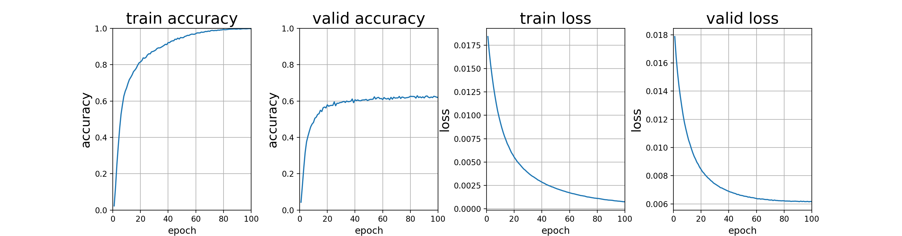
  Valid set Accuracy 最终稳定在 **61%** 左右


### ModelA
- Fine tune Conv5_x.


对`Conv5_x.`也就是模型的`layer4`中全部conv层开放梯度反向传播
```python
# -- Load Baseline model  --
# layer4 / conv5_x
model.layer4[0].conv1.weight.requires_grad = True
model.layer4[0].conv2.weight.requires_grad = True
model.layer4[0].downsample[0].weight.requires_grad = True
model.layer4[1].conv1.weight.requires_grad = True
model.layer4[1].conv2.weight.requires_grad = True
```

- ModelA **训练结果**
  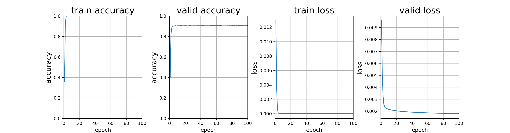
  Valid set Accuracy 最终稳定在 **90%** 左右


### ModelB
- Fine tune Conv4_x and Conv5_x. 
对`Conv4_x.`、`Conv5_x.`也就是模型的`layer4`和`layer3`中全部conv层开放梯度反向传播
```python
# -- Load Baseline model  --
# layer3 / conv4_x
model.layer3[0].conv1.weight.requires_grad = True
model.layer3[0].conv2.weight.requires_grad = True
model.layer3[0].downsample[0].weight.requires_grad = True
model.layer3[1].conv1.weight.requires_grad = True
model.layer3[1].conv2.weight.requires_grad = True
# layer4 / conv5_x
model.layer4[0].conv1.weight.requires_grad = True
model.layer4[0].conv2.weight.requires_grad = True
model.layer4[0].downsample[0].weight.requires_grad = True
model.layer4[1].conv1.weight.requires_grad = True
model.layer4[1].conv2.weight.requires_grad = True
```

- ModelB **训练结果**
  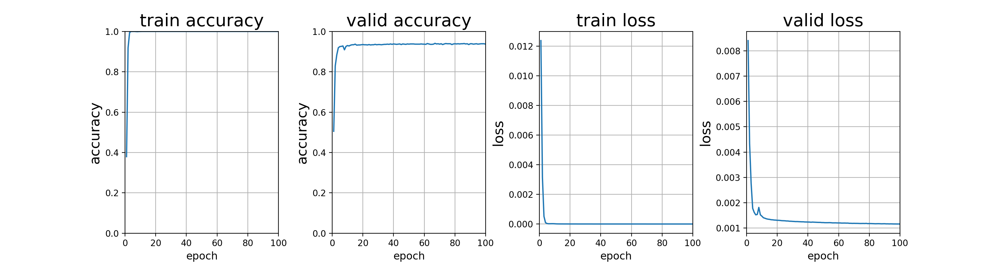
  Valid set Accuracy 最终稳定在 **93%** 左右

### ModelC
- Fine tune ALL convolution layers. 

对全部conv层开放梯度反向传播
```python
# -- Load Baseline model  --
# conv1_x
model.conv1.weight.requires_grad = True
# layer1 / conv2_x
model.layer1[0].conv1.weight.requires_grad = True
model.layer1[0].conv2.weight.requires_grad = True
model.layer1[1].conv1.weight.requires_grad = True
model.layer1[1].conv2.weight.requires_grad = True
# layer2 / conv3_x
model.layer2[0].conv1.weight.requires_grad = True
model.layer2[0].conv2.weight.requires_grad = True
model.layer2[0].downsample[0].weight.requires_grad = True
model.layer2[1].conv1.weight.requires_grad = True
model.layer2[1].conv2.weight.requires_grad = True
# layer3 / conv4_x
model.layer3[0].conv1.weight.requires_grad = True
model.layer3[0].conv2.weight.requires_grad = True
model.layer3[0].downsample[0].weight.requires_grad = True
model.layer3[1].conv1.weight.requires_grad = True
model.layer3[1].conv2.weight.requires_grad = True
# layer4 / conv5_x
model.layer4[0].conv1.weight.requires_grad = True
model.layer4[0].conv2.weight.requires_grad = True
model.layer4[0].downsample[0].weight.requires_grad = True
model.layer4[1].conv1.weight.requires_grad = True
model.layer4[1].conv2.weight.requires_grad = True
```

- ModelC **训练结果**
  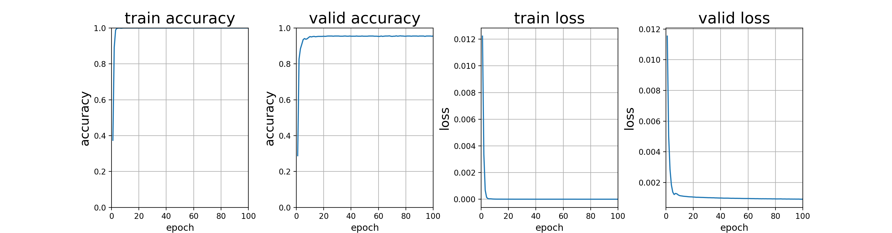
  Valid set Accuracy 最终稳定在 **95%** 左右

### ModelD

- [x] [ModelD(fc:256+128)](#modeldfc256128): 新增的全连接层为 `256 neuron` + `128 neuron`
- [x] [ModelD(fc:256+128 + dropout)](#modeldfc256128--dropout): 新增的全连接层为 `256 neuron` + `128 neuron` 并且有`p=0.5`的dropout层
- [x] [ModelD(fc:1024+512)](#modeldfc1024512): 新增的全连接层为 `1024 neuron` + `512 neuron`
- [x] [ModelD(fc:1024+512 + dropout)](#modeldfc1024512--dropout): 新增的全连接层为 `1024 neuron` + `512 neuron` 并且有`p=0.5`的dropout层
- [x] [ModelD(fc:2048+1024)](#modeldfc20481024): 新增的全连接层为 `2048 neuron` + `1024 neuron`
- [x] [ModelD(fc:2048+1024 + dropout)](#modeldfc20481024--dropout): 新增的全连接层为 `2048 neuron` + `1024 neuron` 并且有`p=0.5`的dropout层


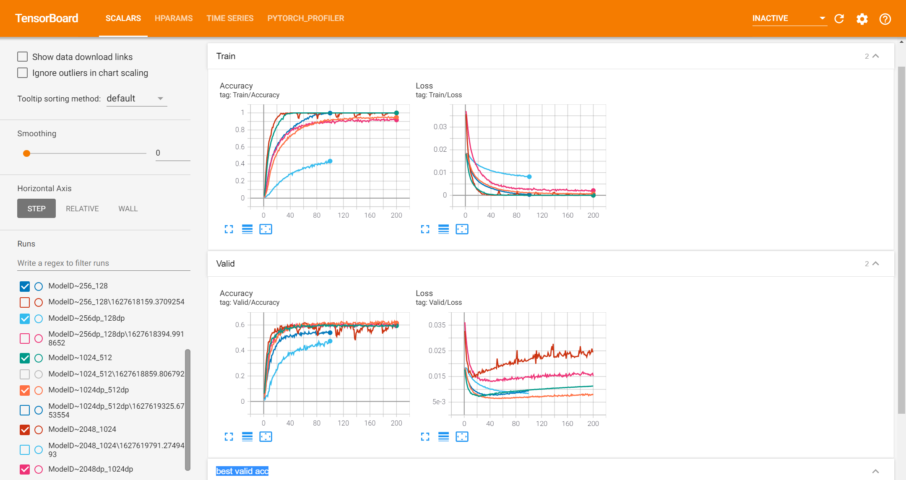

**freeze全部卷积层，增加两层fc之后，并没有很好地提高模型的精度，最高也只能达到60%左右**

#### ModelD(fc:256+128)
新增的全连接层为 `256 neuron `+ `128 neuron`
```python
# -- Load Baseline model  --
model.fc = nn.Sequential(
    nn.Linear(model.fc.in_features, 256),
    nn.Linear(256, 128),
    nn.Linear(128, len(train_set.classes)))
```

- ModelD(fc:256+128) **训练结果**
  
  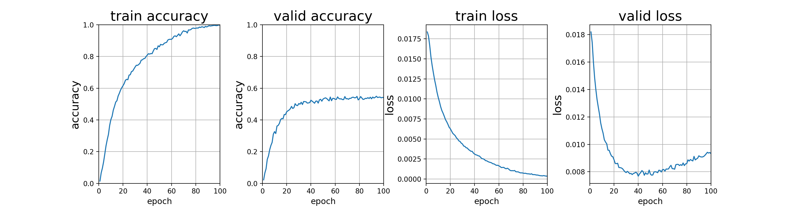
  
  Valid set Accuracy 最终稳定在 **54%** 左右


#### ModelD(fc:256+128 + dropout)
新增的全连接层为 `256 neuron` + `128 neuron` 并且有`p=0.5`的dropout层
```python
# -- Load Baseline model  --
model.fc = nn.Sequential(
    nn.Linear(model.fc.in_features, 256),nn.ReLU(),
    nn.Dropout(p=0.5),
    nn.Linear(256, 128),nn.ReLU(),
    nn.Dropout(p=0.5),
    nn.Linear(128, len(train_set.classes)))
```

- ModelD(fc:256+128 with dropout) **训练结果**
  
  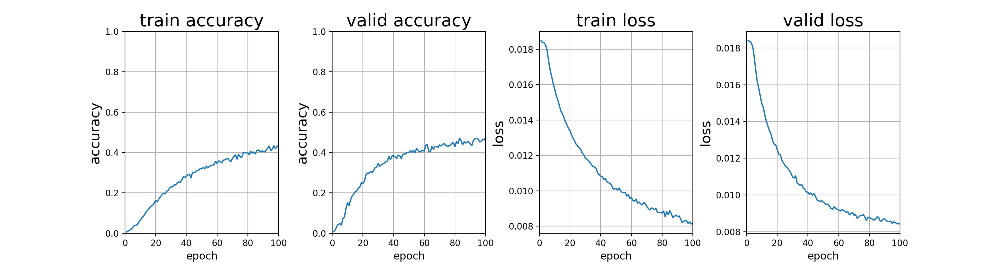
  
  Valid set Accuracy 最终稳定在 **47%** 左右


#### ModelD(fc:1024+512)
新增的全连接层为 `1024 neuron` + `512 neuron`
```python
# -- Load Baseline model  --
model.fc = nn.Sequential(
    nn.Linear(model.fc.in_features, 1024),
    nn.Linear(1024, 512),
    nn.Linear(512, len(train_set.classes)))
```
- ModelD(fc:1024+512) **训练结果**
  
  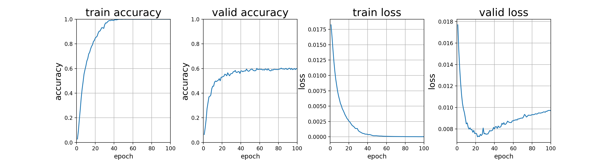
  
  Valid set Accuracy 最终稳定在 **60%** 左右


#### ModelD(fc:1024+512 + dropout)
新增的全连接层为 `1024 neuron` + `512 neuron` 并且有`p=0.5`的dropout层
```python
# -- Load Baseline model  --
model.fc = nn.Sequential(
    nn.Linear(model.fc.in_features, 1024),nn.ReLU(),nn.Dropout(p=0.5),
    nn.Linear(1024, 512),nn.ReLU(),nn.Dropout(p=0.5),
    nn.Linear(512, len(train_set.classes)))
```
- ModelD(fc:1024+512 with dropout) **训练结果**
  
  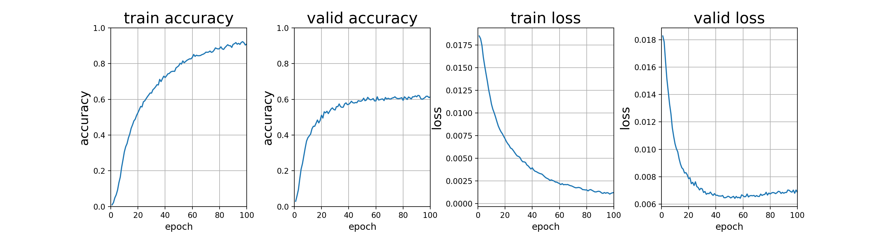
  
  Valid set Accuracy 最终稳定在 **61%** 左右


#### ModelD(fc:2048+1024)
新增的全连接层为 `2048 neuron` + `1024 neuron`
```python
# -- Load Baseline model  --
model.fc = nn.Sequential(
    nn.Linear(model.fc.in_features, 2048),
    nn.Linear(2048, 1024),
    nn.Linear(1024, len(train_set.classes)))
```
- ModelD(fc:2048+1024) **训练结果**
  
  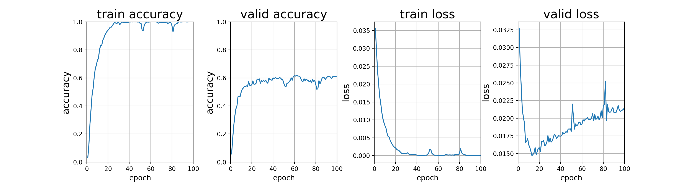
  
  Valid set Accuracy 最终稳定在 **60%** 左右


#### ModelD(fc:2048+1024 + dropout)
新增的全连接层为 `2048 neuron` + `1024 neuron` 并且有`p=0.5`的dropout层
```python
# -- Load Baseline model  --
model.fc = nn.Sequential(
    nn.Linear(model.fc.in_features, 2048),nn.ReLU(),nn.Dropout(p=0.5),
    nn.Linear(2048, 1024),nn.ReLU(),nn.Dropout(p=0.5),
    nn.Linear(1024, len(train_set.classes)))
```

- ModelD(fc:2048+1024 with dropout) **训练结果**

  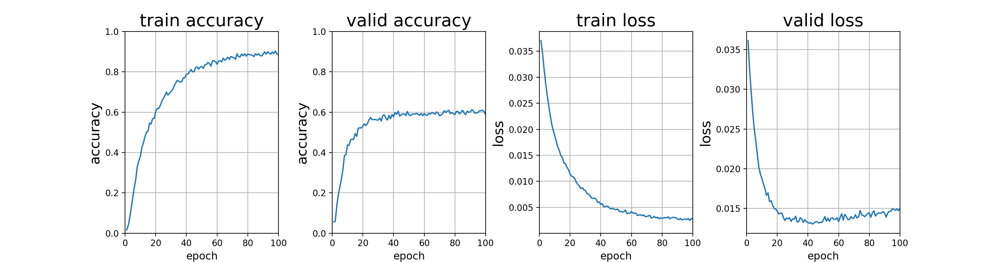

  Valid set Accuracy 最终稳定在 **60%** 左右


